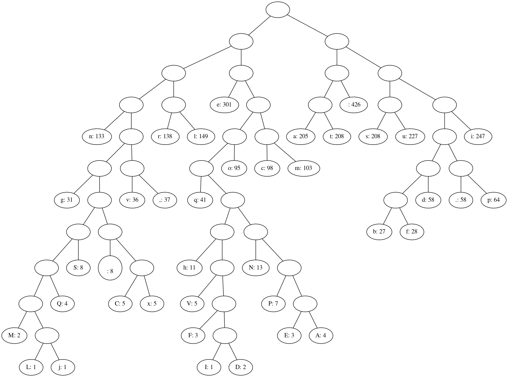

# Huffman encoder/decoder
Very basic implementation just to get the idea. 
  * works for first 5 paragraphs of _lorem ipsum_
  * coding on individual characters level
  * no error handling

Working principle:
  * `utils.py` provides functions one can use to:
    * get word occurrence counts for a string (`symbol_freq`)
    * build a binary tree based on these counts,
      using simple min-heap implementation (`build_tree`)  
    * build Huffman codewords based on that tree (`build_codewords`)
    * save codewords to file and load them from file (`dump_cw`, `load_cw`)
  * `Encoder` class is dead simple, just use the codeword table
  * `Decoder` class builds a trie based on codewords
    and then traverses it during decoding
    
Running the example provided requires `graphviz` package.
It produces the following tree of occurrence counts that 
Huffman codewords are based on.

As it turns out, the encoded representation uses 15786 
bits as opposed to 24008 required with ASCII encoding.
